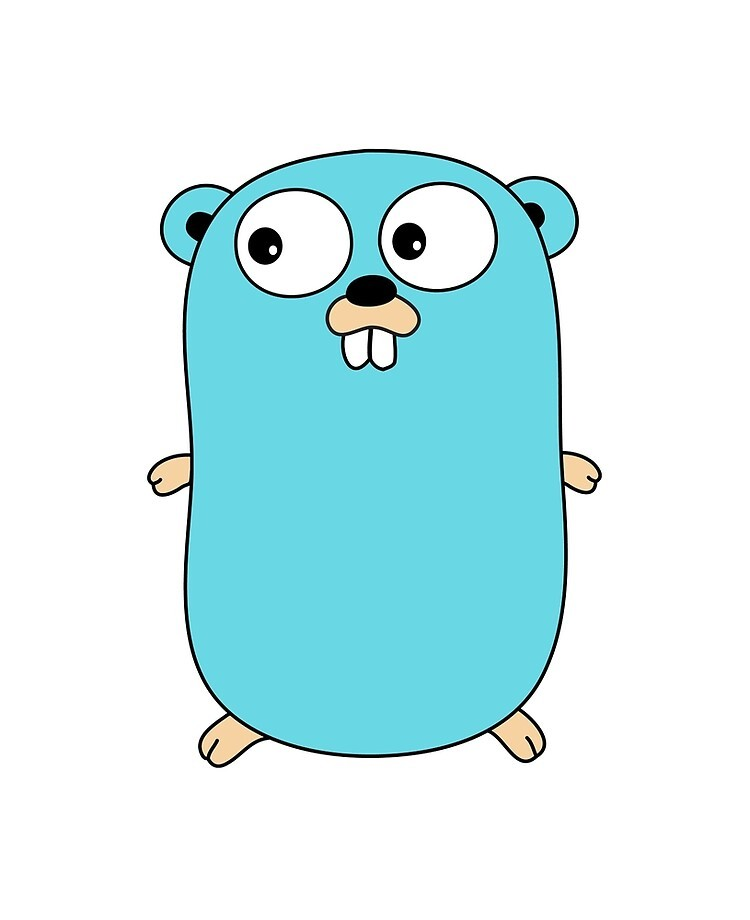

This course covers various topics in GoLang, providing a comprehensive guide to learning the language. Each topic is organized into folders for easy navigation.



# Difference Between C++, Python, and Go


# Key Features of Go Language
## 1. Concurrency: 
Go is built with concurrency in mind and provides several features to make it easy to write concurrent code.
- a. It's the idea that different tasks can be performed independently and simultaneously.
- b. Easy tasks don't wait for the other to finish before starting their work.

## 2. Garbage Collection: 
Go includes a garbage collector that automatically manages memory, making it easier for developers to write code without having to worry about memory management.

# 5. Install Golang, Go Modules, and Packages

# Go - Golang Quick Intro Study Notes 📝💨

This is my study notes for Golang. It is a quick intro/guide to start with Golang if you have prior programming experience.

## Table of Contents
- [🏓 Go Fundamentals](#--go-fundamentals)
  * [Notes](#notes)
  * [Variables Declaration](#variables-declaration)
  * [Go Primitive Types](#go-primitive-types)
  * [Visibility](#visibility)
  * [Take Input from Console](#take-input-from-console)
  * [Iota](#iota)
  * [Go Pointers](#go-pointers)
  * [Go If-Conditions](#go-if-conditions)
  * [Go For-Loops](#go-for-loops)
  * [Go For-Each Loop](#go-for-each-loop)
  * [Go Switch Statement](#go-switch-statement)
  * [Type Function and Returning Functions](#type-function-and-returning-functions)
- [✨ Go Functions and Return Types](#-go-functions-and-return-types)
  * [Notes](#notes-1)
  * [Typical Function](#typical-function)
  * [Multiple Returns](#multiple-returns)
  * [Named Returns](#named-returns)
  * [Variadic Functions / Variable Arguments List](#variadic-functions---variable-arguments-list)
  * [Type Function and Returning Functions](#type-function-and-returning-functions-1)
  * [Callbacks - Passing Functions as Argument](#callbacks---passing-functions-as-argument)
  * [Defer Keyword](#defer-keyword)
  * [Receivers](#receivers)
  * [Overriding Receivers](#overriding-receivers)
- [🏗 Go Data Structures](#--go-data-structures)
  * [Arrays](#arrays)
  * [Slices](#slices)
  * [Iterating Over a Slice](#iterating-over-a-slice)
  * [Appending to Slice](#appending-to-slice)
  * [Common Slice Functions](#common-slice-functions)
  * [Slices Tricks](#slices-tricks)
  * [Maps](#maps)
- [🏢 Go Structs / OOP](#--go-structs---oop)
  * [Notes](#notes-2)
  * [Go Supports](#go-supports)
    + [Encapsulation](#encapsulation)
    + [Inheritance and Reusability](#inheritance-and-reusability)
    + [Polymorphism and Interfaces](#polymorphism-and-interfaces)
    + [Overriding](#overriding)
- [🥂 Go Concurrency](#--go-concurrency)
  * [Intro](#intro)
  * [Notes](#notes-3)
  * [Mutex Locks, WaitGroups, and Atomic Operations](#mutex-locks--waitgroups--and-atomic-operations)
  * [Go Channels](#go-channels)
    + [Example 1](#example-1)
    + [Example 2](#example-2)
    + [Example 3](#example-3)
    + [Example 4](#example-4)
    + [Example 5 - Semaphores](#example-5---semaphores)
    + [Example 6 - Using Channels as Arguments/Returns](#example-6---using-channels-as-arguments-returns)
- [🐞 Go Error Handling](#--go-error-handling)
  * [Notes](#notes-4)
  * [Example](#example)

---

# 🏓 Go Fundamentals

## Notes

1. **Program Executable** is at `package main/func main()`
```go
package main        // Executables must be of package main
import "fmt"
        
func main() {
    var g string = "Hello golang"
    println(g)
}
        
func function() string {
    return "Five of Diamonds"
}
```

2. **Blank Identifier**: Use `_` to replace unused variables.
3. There are two primitive ways to allocate to a pointer: `new()` and `make()`. They differ though; we will discuss that later. Briefly, `new` returns a pointer, while `make` returns a value. Read [Doc](https://golang.org/doc/effective_go.html#allocation_new).
4. Everything is **passed by value** except **arrays, slices, maps, and channels**, which are reference types. These types are passed by reference (they internally have pointers, so no copying of the actual data happens when passing them).
5. Unlike in C, it's perfectly OK to return the address of a local variable; the storage associated with the variable survives after the function returns.

## Variables Declaration

```go
// Declaration
var g string

// Assignment
g = "golang"

// Declaration & Assignment
var g = "golang"
var g string = "golang"

// Shorthand - Declaration & Assignment
a := 10
b := "golang"
```

*Uninitialized variables are given their zero value (e.g., int = 0, string = "", bool = false)*

## Go Primitive Types

The possible values for `bool` are `true` and `false`.

- **uint8**: unsigned 8-bit integers `(0 to 255)`
- **uint16**: unsigned 16-bit integers `(0 to 65535)`
- **uint32**: unsigned 32-bit integers `(0 to 4294967295)`
- **uint64**: unsigned 64-bit integers `(0 to 18446744073709551615)`
- **int8**: signed 8-bit integers `(-128 to 127)`
- **int16**: signed 16-bit integers `(-32768 to 32767)`
- **int32**: signed 32-bit integers `(-2147483648 to 2147483647)`
- **int64**: signed 64-bit integers `(-9223372036854775808 to 9223372036854775807)`
- **int** is either **int64** or **int32**, depending on the implementation.
- **float32**: set of `all IEEE-754 32-bit` floating-point numbers
- **float64**: set of `all IEEE-754 64-bit` floating-point numbers
- **complex64**: the set of all complex numbers with float32 real and imaginary parts
- **complex128**: the set of all complex numbers with float64 real and imaginary parts
- `byte` alias for `uint8`, `rune` alias for `int32`

## Visibility

If `variables`/`functions` start with an uppercase character, they are accessible outside the scope of their package; if lowercase, they are only accessible inside their package.

```go
package myPkg

var Uppercase = "This is accessible outside the pkg"
var lowercase = "This is not accessible outside the pkg"
func UppercaseFunc() string { return "This is accessible outside the pkg" }
func lowercaseFunc() string { return "This is not accessible outside the pkg" }

// Another file:
package main
import "myPkg"

func main() {
  // Accessible
  println(myPkg.Uppercase)
  println(myPkg.UppercaseFunc())

  // Not Accessible
  println(myPkg.lowercase)
  println(myPkg.lowercaseFunc())
}
```

## Take Input from Console

```go
// Take input like cin >> in C++
var x int = 1337
var y string = "string value"

_, err := fmt.Scan(&x, &y)
fmt.Println("You Entered x:", x, " and y:", y, " Error:", err)

// Take input like scanf in C
_, err = fmt.Scanf("%d %s", &x, &y)
fmt.Println("You Entered x:", x, " and y:", y, " Error:", err)

// Take input with white spaces
var z string = "string"
scanner := bufio.NewScanner(os.Stdin)
scanner.Scan()
z = scanner.Text()
fmt.Println("You Entered z:", z)
```

## Iota

`iota` in Go is a value used within the **const** block. Its value starts at 0 per block and increments each time it is used again.

```go
const (
  c0 = iota  // c0 == 0
  c1 = iota  // c1 == 1
  c2 = iota  // c2 == 2
)
```

## Go Pointers

Pointers syntax is essentially like C/C++.

```go
var value int = 1000
var pointer *int = &value
println(value)                // 1000
println(pointer)              // 0xFFFFFFFFF
println(*pointer)             // 1000
(*pointer)++                  // 1001
*pointer = *pointer + 10      // 1011
println(*pointer)             // 1011
println(*pointer + *pointer)  // 1011 + 1011 = 2022
```

## Go If-Conditions

- Braces must open in the same line as the if/else (Aghh 😕)
- In Go's if-statements, **parentheses ( )** around conditions are optional, but the **braces { } are required** even for one-liners.

```go
value := 10
if value < 10 {
    println("Less Than 10")
} else if value > 10 {
    println("Greater Than 10")
} else {
    println("Equals 10")
}

// If conditions with statement
// Note that value is in scope of all if/else's 
if value := 10; value < 10 {
    println(value, "Less Than 10")
} else if value > 10 {
    println(value, "Greater Than 10")
} else {
    println(value, "Equals 10")
}
```

Go doesn't have a Ternary Operator (`x < 0 ? A : B`) 🤷

## Go For-Loops

There are **3 forms** of for loops. Also, **there is no while loop syntax in Go** (instead, it's a form of for loops). There is also no do-while at all.

```go
// For loop
for j := 7; j <= 9; j++ { /*stuff*/ }

// While-like for loop
i := 1
for i <= 3 { /*stuff*/ i++ }

// Infinite Loop: While(true)
for { /*stuff*/ if (/*stuff*/) break }
```

## Go For-Each Loop

```go
for i, v := range arr {  // do stuff }
for _, v := range arr {  // do stuff }
for i, _ := range arr {  // do stuff }
```

## Go Switch Statement

Switch statements in Go don't require `break`; they will break by default. The `fallthrough` keyword is used to go to the NEXT statement even if the condition doesn't match. `fallthrough` is like a break, so no code can be after it. However, a workaround is to use `labels` and `goto`.

```go
i := 2
fmt.Println("Switch for i =", i, "goes to: ")
switch i {
  case 1:
    fmt.Println("one")
  case 2:
    fmt.Println("two")
    i = 4
    fallthrough // goes to NEXT case even if it doesn't match
  case 3:
    fmt.Println("three")
  case 4:
    fmt.Println("four")
  case 5, 6:
    fmt.Println("five or six")
  default:
    fmt.Println("default")
}
```


## Type Function and Returning Functions

1. Functions can be assigned to variables `func0 := func() int {x++; return x}`
2. Functions that are returned from another functions has its own scope per returned function (yea ikr ? 🤷).
``` Go

package main

var x = 0

func main() {
  //local x
  x := 0

  func0 := func() int {x++; return x}
  func1 := incrementGlobalX //without ()
  func2 := wrapper()
  func3 := wrapper()

  println(func0(), " : func0 (local x)")
  println(func1(), " : func1 (global x)")
  println(func2(), " : func2 (per func scope x1)")
  println(func3(), " : func3 (per func scope x2)")
  println("Second Increment")
  println(func0(), " : func0 (local x)")
  println(func1(), " : func1 (global x)")
  println(func2(), " : func2 (per func scope x1)")
  println(func3(), " : func3 (per func scope x2)")
}

func incrementGlobalX() int  {
  x++
  return x
}

func wrapper() func() int {
  x := 0
  return func() int {
    x++
    return x
  }
}
```  
      
      
--------------------------------------------------------------------------
      

# ✨ Go Functions and Return Types

## Key Notes:
- **Pass-by-Value vs Pass-by-Reference**: 
  - In Go, **everything is passed by value**, except **arrays, slices, maps, and channels**, which are **reference types**. These types are passed by reference, meaning changes made to these variables inside the function affect the original variable.
  
- **Returning Addresses of Local Variables**: 
  - Unlike in C, it’s perfectly fine to return the address of a local variable in Go. The storage associated with the local variable survives after the function returns, unlike C where this can lead to undefined behavior.

---

## Typical Function Definitions

A typical Go function consists of the following parts:
1. **Arguments**: Variables passed to the function.
2. **Return Type**: The type of value the function will return (if any).

### Examples:
1. **Function without Return Value**:
   ```go
   func add(x int, y int) {
       fmt.Println("Hello, World!")
   }
   ```
   - This function takes two integers but doesn’t return anything. It simply prints a message.

2. **Function with Return Value**:
   ```go
   func add(x int, y int) int {
       return x + y
   }
   ```
   - This function returns the sum of two integers.

3. **Shorthand for Same Type Arguments**:
   ```go
   func add(x, y int) int {
       return x + y
   }
   ```
   - You can skip specifying the type for each argument when they are the same type.

---

## Multiple Return Values

Go allows you to return multiple values from a function, which is a powerful feature used in scenarios like swapping variables.

### Example:
```go
func swap(x, y string) (string, string) {
    return y, x
}

func main() {
    a, b := swap("hello", "world")
    fmt.Println(a, b) // Prints: "world hello"
}
```
- **Focus**: Go’s multiple return values make it easy to return more than one value, unlike languages like C/C++ that support only a single return value.

---

## Named Return Values

In Go, you can name the return variables. The function will return these named variables by default, and you can also override them in the return statement.

### Example:
```go
func split(sum int) (x, y int) {
    x = sum * 4 / 9
    y = sum - x
    return // Implicit return of x, y
}
```
- **Focus**: Named return variables can make code cleaner and more readable, especially for functions with multiple returns.

---

## Variadic Functions (Variable Argument List)

Go supports variadic functions, where the number of arguments passed can vary. These arguments are passed as a slice.

### Example:
```go
func average(x int, values ...int) float64 {
    fmt.Println("Single argument value:", x)
    fmt.Println("Variable argument values:", values)

    total := 0
    for _, value := range values {
        total += value
    }

    return float64(total) / float64(len(values))
}

func main() {
    avg := average(10, 20, 30, 40, 50)
    fmt.Println("Average:", avg) // Outputs: Average: 30
}
```
- **Focus**: The `...` syntax allows the function to accept a variable number of arguments, and these arguments are accessed as a slice inside the function.

---

## Functions as First-Class Citizens (Returning Functions)

Functions in Go can be treated as first-class citizens, meaning they can be assigned to variables, passed as arguments, and returned from other functions. 

### Example 1: Assigning Functions to Variables
```go
func add(x int, y int) int {
    return x + y
}

func main() {
    sum := add
    fmt.Println(sum(3, 4)) // Outputs: 7
}
```

### Example 2: Returning Functions from Other Functions (Closures)
```go
package main

var x = 0

func main() {
    x := 0
    func0 := func() int { x++; return x }
    func1 := incrementGlobalX
    func2 := wrapper()
    func3 := wrapper()

    fmt.Println(func0(), " : func0 (local x)")
    fmt.Println(func1(), " : func1 (global x)")
    fmt.Println(func2(), " : func2 (per func scope x1)")
    fmt.Println(func3(), " : func3 (per func scope x2)")

    fmt.Println("Second Increment")
    fmt.Println(func0(), " : func0 (local x)")
    fmt.Println(func1(), " : func1 (global x)")
    fmt.Println(func2(), " : func2 (per func scope x1)")
    fmt.Println(func3(), " : func3 (per func scope x2)")
}

func incrementGlobalX() int {
    x++
    return x
}

func wrapper() func() int {
    x := 0
    return func() int {
        x++
        return x
    }
}
```
- **Focus**: 
   - The `wrapper` function returns a new function, which is a **closure**. Closures remember the environment in which they were created, including local variables.
   - The example demonstrates local variables in the main function (`func0`), global variables (`func1`), and function-specific scopes (`func2` and `func3`).

---

## Summary and Key Points to Focus On:
- **Pass-by-value**: Go passes all types by value, except reference types like slices, maps, and channels, which are passed by reference.
- **Named Returns**: Useful for clarity, but the return values can be overridden in the return statement.
- **Variadic Functions**: Great for accepting a variable number of arguments; always passed as a slice.
- **Function Closures**: Understanding how functions can be returned from other functions and how closures capture their environment is key to mastering Go.

## Callbacks - Passing Functions as Arguments

In Go, you can pass functions as arguments to other functions. This allows you to define custom behavior that can be executed within the function.

### Example:
```go
func visit(numbers []int, callback func(int)) {
    for _, n := range numbers {
        callback(n * 2) // Calls the callback with each number multiplied by 2
    }
}

func main() {
    visit([]int{1, 2, 3, 4}, func(n int) {
        fmt.Println(n, "- Printed within the callback function.") // The callback prints each processed number
    })
}
```
### Explanation:
- **`visit` function**: It takes a slice of integers (`numbers`) and a function (`callback`) as arguments. For each number in the slice, it calls the `callback` function, passing the number multiplied by 2.
- **Main function**: In the `main`, an anonymous function is passed as the callback, which prints the number processed by `visit`.

---

## Defer Keyword

The `defer` keyword in Go allows you to delay the execution of a function until the surrounding function returns. It’s typically used for cleanup tasks, such as closing files or freeing resources. Think of `defer` as ensuring that certain actions occur before the function exits, no matter how the function ends (e.g., through return or error).

### Example:
```go
fmt.Println("One")
defer fmt.Println("Four")  // Will be executed last
defer fmt.Println("Three") // Will be executed before "Four"
fmt.Println("Two")

// Output:
// One
// Two
// Three
// Four
```
### Explanation:
- The `defer` statement is used to postpone the execution of the functions until the end of the current function's scope.
- These deferred functions are executed in **LIFO (Last In, First Out)** order, meaning the last deferred function is executed first.

---

## Receivers

In Go, methods are associated with types (including structs) via **receivers**. A receiver is like the `this` keyword in other languages (such as Java), representing the instance of the type that the method is called on.

### Example:
```go
type rect struct {
    width, height int
}

// Method with a receiver of type *rect (pointer to rect)
func (r *rect) area() int {
    return r.width * r.height
}

func main() {
    r := rect{2, 3} // Creating an instance of rect
    areaX := r.area() // Calling the area method on the rect instance
    fmt.Println(areaX) // Output: 6
}
```
### Explanation:
- **`rect` struct**: Defines a rectangle with a width and height.
- **`area` method**: Calculates the area of the rectangle. It uses a pointer receiver (`*rect`), meaning it can modify the `rect` instance if needed.
- **Method Call**: The `area` method is called on an instance of `rect` to compute its area.

---

## Overriding Receivers

In Go, you can define methods for both base types and types that **embed** other types (such as structs embedding other structs). While Go doesn’t have traditional inheritance, you can simulate it by embedding one struct into another. Methods can be overridden when embedding a struct.

### Example:
```go
type Person struct {
    First string
    Last  string
    Age   int
}

type Employee struct {
    Person  // Embedding Person struct into Employee
    ID      string
    Salary  int
}

// Method for Person struct
func (p Person) FullName() string {
    return p.First + " " + p.Last
}

// Overriding method for Employee struct
func (e Employee) FullName() string {
    return e.ID + " " + e.First + " " + e.Last
}

func main() {
    // Create an instance of Employee with embedded Person
    x := Employee{
        Person: Person{
            First: "Sherif",
            Last:  "Abdel-Naby",
            Age:   12,
        },
        ID:     "0ID12000ID",
        Salary: 9999,
    }

    fmt.Println(x)                     // Outputs: {Person: {Sherif Abdel-Naby 12} 0ID12000ID 9999}
    fmt.Println(x.Person.FullName())    // Outputs: Sherif Abdel-Naby (using Person's FullName method)
    fmt.Println(x.FullName())           // Outputs: 0ID12000ID Sherif Abdel-Naby (using Employee's overridden FullName method)
}
```

### Explanation:
- **`Person` struct**: Defines a person with a first name, last name, and age.
- **`Employee` struct**: Embeds `Person` and adds additional fields (ID and Salary). 
- **Method Overriding**: The `Employee` struct overrides the `FullName` method of the `Person` struct to provide a custom implementation that includes the employee's ID.

- **Output**:
   - `x.Person.FullName()` calls the `FullName` method from the embedded `Person` struct.
   - `x.FullName()` calls the overridden method from the `Employee` struct, which includes the employee’s ID.

---

### Key Takeaways:
- **Callbacks**: Passing functions as arguments allows for more flexible and reusable code.
- **Defer**: Useful for cleaning up resources or ensuring that certain actions are performed at the end of a function’s scope.
- **Receivers**: Methods can be associated with structs through receivers, and using pointer receivers allows methods to modify the struct's fields.
- **Overriding**: Go doesn’t have inheritance, but embedding structs allows you to simulate inheritance and override methods for more specific behavior.


--------------------------------------------------------------------------

## 🏗 Go Data Structures: Arrays, Slices, Maps, and Structs

### Arrays

- **Fixed size**: Once the size of an array is defined, it cannot be changed.
- **Zero values**: Array elements are automatically initialized to their zero value (e.g., `0` for integers, `""` for strings).
  
#### Example:
```go
var x [15]int       // Array of 15 integers (all initialized to 0)
var twoD [2][3]int  // 2D array with 2 rows and 3 columns
```

---

### Slices

- **Dynamic size**: Unlike arrays, slices can change size dynamically.
- **Backing arrays**: Slices don’t store their own data; they point to a section of an underlying array. Modifying elements of a slice changes the data in the underlying array. Any other slices referencing the same array will reflect these changes.
- **Capacity**: The capacity of a slice refers to the size of the underlying array that the slice can grow into before a new array needs to be allocated.

#### Example (Creating slices):
```go
letters := []string{"a", "b", "c", "d"}  // Slice with 4 elements
s := make([]byte, 5, 5)  // Slice with length 5 and capacity 5
```

#### Explanation:
- `make([]byte, 5, 5)` creates a slice with a length of 5 and a capacity of 5. The slice is initialized with zeroed values (`[0, 0, 0, 0, 0]`).
- `[]byte{0, 0, 0, 0, 0}` is the same as the slice created above but written directly using a literal.

#### Slicing a Slice:
```go
names := [4]string{"John", "Paul", "George", "Ringo"}
a := names[0:2]  // Slice from index 0 to 1: ["John", "Paul"]
b := names[1:3]  // Slice from index 1 to 2: ["Paul", "George"]

fmt.Println(a)  // Output: ["John", "Paul"]
fmt.Println(b)  // Output: ["Paul", "George"]

b[0] = "XXX"    // Modify element in b
fmt.Println(a)  // Output: ["John", "XXX"]
fmt.Println(b)  // Output: ["XXX", "George"]
fmt.Println(names) // Output: ["John", "XXX", "George", "Ringo"]
```
- Slicing a slice does not create a new copy of the data but instead points to the same underlying array, so changes in one slice affect the other.

---

### Iterating Over a Slice

To iterate over a slice, you can use the `range` keyword:

```go
for i, v := range arr {
    // Use index i and value v
}

for _, v := range arr {
    // Use value v, ignore index
}

for i, _ := range arr {
    // Use index i, ignore value
}
```

---

### Appending to Slices

- **Appending**: The `append()` function adds elements to the end of a slice.
  - If there’s enough capacity in the underlying array, the slice grows without allocating new memory.
  - If not, Go allocates a new array, copies the old elements to the new array, and appends the new elements.

#### Example of Appending:
```go
var s []int
s = append(s, 0)  // s becomes [0]
s = append(s, 1)  // s becomes [0, 1]
```

#### Important Concept:
If a new slice is created due to insufficient capacity, the old slice is not updated.

```go
// Allocate new capacity (new array)
var s []int
s = make([]int, 5, 5)
x := append(s, 1, 2, 3)  // Creates a new array with values [1, 2, 3]

x[0] = 1337  // Modify the new slice
s[0] = 6800  // Modify the old slice

fmt.Println(s, x)  // Output: [6800 0 0 0 0] [1337 0 0 0 0 1 2 3]
```

If the slice has enough capacity, appending does not require a new allocation:

```go
// No new allocation
var s []int
s = make([]int, 5, 150)
x := append(s, 1, 2, 3)

x[0] = 1337  // Modify the new slice
s[0] = 6800  // Modify the original slice

fmt.Println(s, x)  // Output: [6800 0 0 0 0] [6800 0 0 0 0 1 2 3]
```

---

### Common Slice Functions

1. **Append Another Slice**:
   - Use the `...` operator to append one slice to another.
   ```go
   a = append(a, b...)  // Append slice b to slice a
   ```

2. **Copy**:
   - Copy elements from one slice to another. The new slice must have enough space to hold the elements.
   ```go
   b = make([]T, len(a))
   copy(b, a)  // Copy elements from a to b

   // Alternative:
   b = append([]T(nil), a...)
   ```

3. **Cut (Remove part of a slice)**:
   - Remove a portion of the slice.
   ```go
   a = append(a[:i], a[j:]...)  // Removes elements between index i and j
   ```

4. **Delete (Remove an element at index)**:
   - Remove an element at a specific index.
   ```go
   a = append(a[:i], a[i+1:]...)  // Remove element at index i
   ```

---

### Slices Tricks

For more advanced tricks with slices, you can explore the [Go Slice Tricks Wiki](https://github.com/golang/go/wiki/SliceTricks).

---

### Key Takeaways:
- **Arrays** are fixed-size, while **slices** are dynamic and more flexible.
- **Appending** to slices can modify the underlying array or allocate a new one based on available capacity.
- Using **range** to iterate over slices simplifies looping and accessing elements.
- Functions like **copy**, **append**, and **cut** make working with slices efficient and flexible.


---

## Working with Maps in Go

Maps in Go are used to store key-value pairs, where each key maps to a specific value. Here's a breakdown of how to create and manipulate maps.

### 1. Creating a Map

You can create an empty map using the `make` function:

```go
m := make(map[string]int)  // Creates a map with string keys and int values
```

### 2. Adding Key-Value Pairs

To add key-value pairs to the map, use the following syntax:

```go
m["k1"] = 7
m["k2"] = 13
```

### 3. Printing the Map

You can print the map to display all key-value pairs:

```go
fmt.Println("map:", m)  // Outputs: map: map[k1:7 k2:13]
```

### 4. Accessing Values by Key

You can retrieve a value using the key:

```go
v1 := m["k1"]
fmt.Println("v1:", v1)  // Outputs: v1: 7
```

### 5. Getting the Length of a Map

Use the `len` function to get the number of key-value pairs in the map:

```go
fmt.Println("len:", len(m))  // Outputs: len: 2
```

### 6. Deleting a Key-Value Pair

To remove a key-value pair from the map, use the `delete` function:

```go
delete(m, "k2")
fmt.Println("map:", m)  // Outputs: map: map[k1:7]
```

### 7. Checking if a Key Exists

When accessing a key, you can check whether it exists by using the second return value:

```go
_, prs := m["k2"]
fmt.Println("prs:", prs)  // Outputs: prs: false
```

If the key is not found, the second return value will be `false`. If the key exists, it will be `true`.

### 8. Using Zero Value for Missing Keys

When you access a non-existent key, Go returns the zero value for the map's value type (e.g., `0` for `int`, `""` for `string`):

```go
fmt.Println("key not found (gets zero value):", m["notFoundKey"])  // Outputs: key not found (gets zero value): 0
```

### 9. Declaring and Initializing a Map in One Line

You can also initialize a map and declare it in a single line:

```go
n := map[string]int{"foo": 1, "bar": 2}
fmt.Println("map:", n)  // Outputs: map: map[foo:1 bar:2]
```


--------------------------------------------------------------------------


# 🏢Go Structs / OOP

## Notes

- in Go you don't create classes, but create types
- in Go you don't do inheritance, you create a value of the type (sort of delegation or embedding a type inside the other and use its methods with some syntactic sugar.
- in Go structs fields can have a tag, it is written between `' '` after field type, tags can be used to e.g exclude or rename a field when Encoding/Decoding it to/from JSON
- Fields and Methods in GO that start with **Uppercase** are exported, hence **they are not seen outside the package and in another packages**, lowercase are unexported fields which are only seen inside their package. e,g Json Encode won't encode unexported fields as Json Encoder package won't be able to access it.

## Go supports

### Encapsulation

- State/Fields
- Methods
- Public/Private → Exported/unexported

### Inheritance and Reusability

``` Go

package main
import "fmt"

type Parent struct {
  First string
  Last string
  Age int
}

type Child struct {
  Parent
  First string
  Middle string
}


func main() {

  x := Child{
    Parent{
      "First",
      "Last",
      12},
    "Child's First",
    "Middle",
  }

  fmt.Println(x)

  fmt.Println(x.First)
  fmt.Println(x.Parent.First)
  fmt.Println(x.Middle)

  fmt.Println(x.Last)
  fmt.Println(x.Parent.Last)

  fmt.Println(x.Age)
  fmt.Println(x.Parent.Age)

}
```
Packages might need your type to implement its interface to work, for example the `sort` package requires you to implement `swap`, `less`, `equal` methods in order to work. also `fmt.Println()` requires you to implement `func (t T) String() string`

### Polymorphism and Interfaces

A type implements an interface by implementing its methods. There is no explicit declaration of intent, no "implements" keyword.

``` Go

// Here's a basic interface for geometric shapes.
type geometry interface {
  area() float64
  perim() float64
  //extraFunc() string	//if we uncomment this, so rect and circle won't
              // be implementing the geometry interface
}

// For our example we'll implement this interface on
// `rect` and `circle` types.
type rect struct {
  width, height float64

}
type circle struct {
  radius float64
}

// To implement an interface in Go, we just need to
// implement all the methods in the interface. Here we
// implement `geometry` on `rect`s.
func (r rect) area() float64 {
  return r.width * r.height
}
func (r rect) perim() float64 {
  return 2*r.width + 2*r.height
}

// The implementation for `circle`s.
func (c circle) area() float64 {
  return math.Pi * c.radius * c.radius
}
func (c circle) perim() float64 {
  return 2 * math.Pi * c.radius
}

// If a variable has an interface type, then we can call
// methods that are in the named interface. Here's a
// generic `measure` function taking advantage of this
// to work on any `geometry`.
func measure(g geometry) {
  fmt.Println(g)
  fmt.Println(g.area())
  fmt.Println(g.perim())
}

func main() {
  r := rect{width: 3, height: 4}
  c := circle{radius: 5}

  // The `circle` and `rect` struct types both
  // implement the `geometry` interface so we can use
  // instances of
  // these structs as arguments to `measure`.
  measure(r)
  measure(c)
}
```
### Overriding

``` Go

  type Person struct {
    First string
    Last string
    Age int
  }

  type Employee struct {
    Person
    ID string
    Salary int
  }

  func (p Person) FullName() string{
    return p.First + " " + p.Last
  }

  //Override
  func (p Employee) FullName() string{
    return p.ID + " " + p.First + " " + p.Last
  }


  func main() {

    x := Employee{
      Person{
        "Sherif",
        "Abdel-Naby",
        12},
      "0ID12000ID",
      9999,
    }

    fmt.Println(x)
    fmt.Println(x.Person.FullName()) //Sherif Abdel-Naby
    fmt.Println(x.FullName()) 		 //0ID12000ID Sherif Abdel-Naby
```


--------------------------------------------------------------------------


# 🥂Go Concurrency

## Intro

Go Concurrency is made available by what's called `go-routines` , basically when a function is preceded with the `go` keyword, it runs in a `go-routine`, think of go-routine as a thread (***though they're different...**)**.*** go-routines is one of the most important features of Go that makes it and its concurrency model special.

For data synchronization you can use mutex Locks, WaitGroups, and Atomic operations, however..
**It's recommended** to use Go Channels for data synchronization, though using the sync package (using mutex, locks, atomics, and WaitGroups) is also usable if it make sense for your use case.

---

## Notes

1. GO executable exits with active go routines running.

## mutex Locks, WaitGroups, and Atomic operations

[//TODO](//todo) Example on using synchronization by mutex Locks, WaitGroups, and Atomic operations

## Go Channels

- channels in layman terms are like a synchronized bucket that contains data, a go-routine can add data to the channel, or extract data from the channel. There are unbuffered channels, and buffered channels. for unbuffered channels if you're adding data to the channel, adding another data will be blocking until another go-routine extract such data. on the other hand receiving is also blocking until data is put in the channel.
GO Buffered channel add a buffer to the go channel to avoid stalls, however it is not recommended to use it as a beginner, uses it only when it makes sense.
- Channels can be `bidirectional (chan)`, `receive (<-chan)` only, or `send only(chan <-)` , send/receive only channels are useful when channels are passed as arguments, this indicates(and rather enforces) that the passed channel can only be received from (and you can send to), so this introduces some sort of control over how channels are used. think of pkgs where I don't want users to send anything to my channel.

### Example 1

Note that I am using time.Sleep at the end to wait for the code to execute as the program will instantly close after running the two go routines.
```Go
c := make(chan int)

go func() {
  for i := 0; i < 9; i++ {
    time.Sleep(time.Second)
    c <- i
  }
}()

go func() {
  for{
    fmt.Println( <- c )
  }
}()

time.Sleep(time.Second * 15)
```
### Example 2

Using Range on a channel, it will iterate over values added on the channel until the channel is closed.
No need to use time.sleep as the for-range is a blocking function.
```Go
c := make(chan int)

go func() {
  for i := 0; i <= 10; i++ {
    time.Sleep(time.Second)
    c <- i
  }
  close(c)
}()

for n := range c{
  fmt.Println(n)
}
```
### Example 3

Using wait-group to use more than 1 function to write to the same channel.
Using a `waitGroup` to close the channel once the two writing functions signal `wg.Done()`
```Go
c := make(chan int)

var wg sync.WaitGroup

wg.Add(2)

go func() {
  for i := 0; i <= 10; i++ {
    time.Sleep(time.Millisecond * 350)
    c <- i
  }
  wg.Done()
}()

go func() {
  for i := 1000; i <= 1010; i++ {
    time.Sleep(time.Millisecond * 350)
    c <- i
  }
  wg.Done()
}()

go func() {
  wg.Wait()
  close(c)
}()

for n := range c{
  fmt.Println(n)
}
```
### Example 4

Using dynamic number of function calls.

Also notice passing i inside the go func, this is because the value outside is in a for-loop, hence it is changing, so using it inside the the go-routine will lead to unexpected results.
```Go
c := make(chan string)

var wg sync.WaitGroup

n := 10

wg.Add(n)

for i := 0; i < n; i++  {
  go func(i int) {
    for t := i*10; t < i*10 + 10; t++ {
      c <- "From " + 	strconv.Itoa(i) + " : " + strconv.Itoa(t)
    }
    wg.Done()
  }(i)
}

go func() {
  wg.Wait()
  close(c)
}()

for x := range c{
  fmt.Println(x)
}
```
### Example 5 - Semaphores

Using only channels without waitGroup. 
This is done using a channel that store bool (or anything really), and use a function to receive n-done signals then close the main channel.
```Go
c := make(chan string)
done := make(chan bool)

n := 2


for i := 0; i < n; i++  {
  go func(i int) {
    for t := i*10; t < i*10 + 10; t++ {
      c <- "From " + 	strconv.Itoa(i) + " : " + strconv.Itoa(t)
    }
    done <- true
  }(i)
}

go func() {
  //receive the n-dones from the go-routines
  for i := 0; i < n; i++{
    <- done
  }
  close(c)
}()

for x := range c{
  fmt.Println(x)
}
```

### Example 6 - Using channels as arguments/returns

In this example we sum values from 0 to i. e.g( i = 3 → 0+1+2+3 = 6)

---

This code we create a go routine that feeds the **increment channels values** 1,2,3
another Channel called the **sum channel** will take the **increment channel and processes its values ( so the sum channel will run until the increment channel closes )**, then the sum channel will **put its sum value for the main to pick**. the point here that main can do other stuff while sum channel finish processing. also we can pass any type of channel to sum channel to sum not necessary an incrementing values in a decoupled way.
```Go
func main() {

  i := 10

  //Return A Channel that produces 1, 2, 3...n
  c := incrementer(i)

  // Take a channel that produces 1,2,3...n and sum these numbers
  // returns a channel that have the data in it after summation (so it is not blocking the main itself)
  cSum := puller(c)

  /* DO STUFF WHILE Puller is working (that's why it is returning a channel */

  //Pull from the puller when we want the result (This is blocking now)
  //Result for i := 10 should be : 10 + 9 + 8 + 7 + 6 + 5 + 4 + 3 + 2 + 1 + 0 = 55
  fmt.Println("Final Sum", <- cSum)

}

//returns an ACTIVE go routine that produces 1,2,3..n
func incrementer(n int) chan int  {
  out := make(chan int, 10)

  //no need to pass n as parameter as it is a non-changing variable in this context
  go func() {
    for i := 0; i <= n; i++ {
      fmt.Println("From incrementer: Produced i = ", i )
      out <- i
      //just to illustrate it is blocking in main.
      time.Sleep(time.Millisecond * 100)
    }
    close(out)
  }()
  return out
}

//takes a channel that produces numbers that are to be summed together.
func puller(c chan int) chan int  {
  out := make (chan int)
  go func() {
    var sum int
    for n := range c{
      fmt.Println("From Puller go-routine: Sum + i ->", sum, "+", n, "=", sum + n)
      sum += n
    }
    fmt.Println("Summation Finished -> Outputing SUM")
    out <- sum
    // also we can output each sum stage for whoever uses the channel and close when finish.
    //close(out)
  }()
  return out
}
```
```
Output:

    From incrementer: Produced i =  0
    From Puller go-routine: Sum + i -> 0 + 0 = 0
    From incrementer: Produced i =  1
    From Puller go-routine: Sum + i -> 0 + 1 = 1
    From incrementer: Produced i =  2
    From Puller go-routine: Sum + i -> 1 + 2 = 3
    From incrementer: Produced i =  3
    From Puller go-routine: Sum + i -> 3 + 3 = 6
    From incrementer: Produced i =  4
    From Puller go-routine: Sum + i -> 6 + 4 = 10
    From incrementer: Produced i =  5
    From Puller go-routine: Sum + i -> 10 + 5 = 15
    Summation Finished -> Outputing SUM
    Final Sum 15
```


--------------------------------------------------------------------------


# 🐞Go Error Handling

## Notes
Go doesn't use try/catch and exceptions to handle errors, instead, functions also returns an error along with its own return. programmer should then check this error by an if-condition and deiced what to do accordingly

## Example

from "Go by Example"...
```Go
// In Go it's idiomatic to communicate errors via an
// explicit, separate return value. This contrasts with
// the exceptions used in languages like Java and Ruby and
// the overloaded single result / error value sometimes
// used in C. Go's approach makes it easy to see which
// functions return errors and to handle them using the
// same language constructs employed for any other,
// non-error tasks.

package main

import "errors"
import "fmt"

// By convention, errors are the last return value and
// have type `error`, a built-in interface.
func f1(arg int) (int, error) {
  if arg == 42 {

      // `errors.New` constructs a basic `error` value
      // with the given error message.
      return -1, errors.New("can't work with 42")

  }

  // A `nil` value in the error position indicates that
  // there was no error.
  return arg + 3, nil
}

// It's possible to use custom types as `error`s by
// implementing the `Error()` method on them. Here's a
// variant on the example above that uses a custom type
// to explicitly represent an argument error.
type argError struct {
  arg  int
  prob string
}

func (e *argError) Error() string {
  return fmt.Sprintf("%d - %s", e.arg, e.prob)
}

func f2(arg int) (int, error) {
  if arg == 42 {

      // In this case we use `&argError` syntax to build
      // a new struct, supplying values for the two
      // fields `arg` and `prob`.
      return -1, &argError{arg, "can't work with it"}
  }
  return arg + 3, nil
}

func main() {

  // The two loops below test out each of our
  // error-returning functions. Note that the use of an
  // inline error check on the `if` line is a common
  // idiom in Go code.
  for _, i := range []int{7, 42} {
      if r, e := f1(i); e != nil {
          fmt.Println("f1 failed:", e)
      } else {
          fmt.Println("f1 worked:", r)
      }
  }
  for _, i := range []int{7, 42} {
      if r, e := f2(i); e != nil {
          fmt.Println("f2 failed:", e)
      } else {
          fmt.Println("f2 worked:", r)
      }
  }

  // If you want to programmatically use the data in
  // a custom error, you'll need to get the error as an
  // instance of the custom error type via type
  // assertion.
  _, e := f2(42)
  if ae, ok := e.(*argError); ok {
      fmt.Println(ae.arg)
      fmt.Println(ae.prob)
  }
```


Topics Covered:
Array: Learn about arrays in GoLang, including CRUD operations.
Data Conversion: Understand data conversion techniques in GoLang.
Defer: Explore the defer keyword and its usage in GoLang.
Error Handling: Learn how to handle errors effectively in GoLang.
File Operations: Discover how to perform file operations in GoLang.
For Loop: Understand the for loop and its variations in GoLang.
Function: Explore functions in GoLang, including declaration and usage.
Goroutine: Learn about goroutines and concurrent programming in GoLang.
sync.WaitGroup: Learn about WaitGroup and it's waiting property for goroutines.
If-Else: Understand conditional statements (if-else) in GoLang.
JSON: Learn how to work with JSON data in GoLang.
Map: Explore the map data structure in GoLang.
Pointer: Understand pointers and their usage in GoLang.
Print: Learn how to print output in GoLang.
Slice: Understand slices and their manipulation in GoLang.
Strings: Learn about string manipulation in GoLang.
Struct: Explore structures and their usage in GoLang.
Switch: Understand the switch statement in GoLang.
Testing: Learn about writing tests in GoLang.
Time: Understand time and date manipulation in GoLang.
URL: Learn how to work with URLs in GoLang.
User Input: Understand how to take user input in GoLang.
Web Requests: Learn how to make web requests in GoLang.
How to Use:
Each folder contains code examples and explanations related to the topic. Simply navigate to the folder of interest to access the content.

Additional Notes:
The course assumes basic knowledge of programming concepts.
Feel free to explore the topics in any order based on your learning preferences.
Happy coding!
